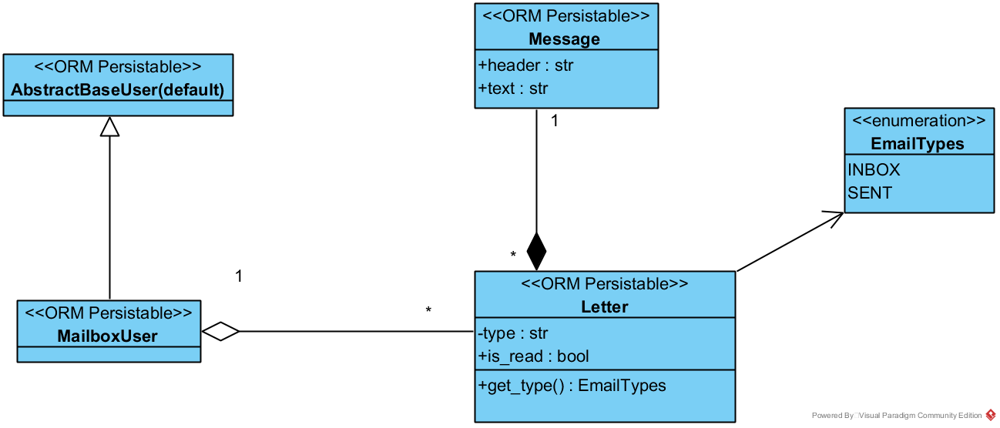

* [Инструкция запуска](documentation/инструкция_запуска.txt)  
* Для работы с уже готовыми данными можно использовать [данные входа](documentation/инструкция_запуска.txt) пользователей
* [Зависимости](documentation/requirements.txt) 

Выпонял тестовое задание для завода "SOKOLOV".
-----------------------------------------------------------------------------------------------------------

**ТЕКСТ ЗАДАНИЯ**  
Представьте, что вы пишите backend для почтового сервера.  
Ваш код не реализует SMTP/POP3/IMAP (за это отвечают другие компоненты),
но предоставляет сервисы хранения (скажем, в postgres) в виде REST API (можно использовать любой фреймворк,
скажем pyramid, django или что-то асинхронное). Для простоты уберем регистрацию пользователей,
сосредоточимся только на хранении самих писем.

У каждого пользователя есть почтовый ящик с 2-мя каталогами (inbox и sent).  
API позволяет пользователю отправить письмо нескольким адресатам.  
И тогда письмо сохраняется в каталог sent отправителя и в каталог inbox каждого из получателей.
Также API должно позволять пользователям просмотреть содержимое своих каталогов (список писем),
получить содержание письма, снять/поставить отметку о прочтении или вообще удалить письмо.
Письмом будем считать объект с заголовком, текстовым содержанием, полем from и набором адресатов (to).  

-------------------------------------------------------------------------------------------------------------

**Описание моего решения**  
Задание выполнял с помощью python 3.8 и django 3.0
Других сторонних библиотек не использовал.

*ЛОГИЧЕСКАЯ МОДЕЛЬ*  
* Кастомизировал пользователя, чтобы можно было авторизовываться по email, и заодно расширить поведением.  
* Добавил две модели которые реализуют само письмо(Letter) и содержимое письма(Message).  
* Содержимое письма вынес в отдельную таблицу, чтобы не множить одни и те же данные.
* [Схема объектно-реляционной модели](documentation/mailbox_orm.png) 

*Другое*  
Не стал делать пометки писем, чтобы не писать клиентский код.  
Так же покрыл тестами функционал с работы с письмами. [Тесты здесь](mail_box/tests.py).  
Всё остальное сделал так как было написано.

*БАЗА ДАННЫХ*  
Постгрес ставить не стал, так как это усложнило бы развёртывание системы конечным пользователем. 
Систему выкладываю вместе с уже созданной и **заполненной** sqlite. 

-----------------------------------------------------------------------------------------------------------
*ORM-mailbox*

